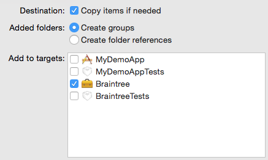

Manual Integration Without CocoaPods
------------------------------------

Please follow these instructions to integrate Braintree iOS into your app without CocoaPods.

> Note: We assume that you are using Xcode 6.1 and iOS 8 as
your Base SDK.

1. Add the Braintree iOS SDK code to your repository
  - Use git: `git submodule add https://github.com/braintree/braintree_ios.git`
  - Alternatively, you can [download braintree_ios from Github](https://github.com/braintree/braintree_ios/archive/master.zip) and unzip it into your app's root directory in Finder
2. Open up your app in Xcode
3. Create a a new framework target called `Braintree` (please use this exact name)
  - In Xcode, select `File > New > Target`
  - Click `Framework & Library`
  - Click `Cocoa Touch Framework` and `Next`
  - Product Name: `Braintree`
  - Language: `Objective C`
  - Embed in Application: `[your app target]`
  - Click `Finish`
  - You will now see a new `Braintree` Target Dependency in your main app target (in the first section of `Build Phases`).
4. Add the Braintree code to project
  - The code is located in `braintree-ios/Braintree`
  - In Xcode, select `File` > `Add Files to [...]...`
  - Select `braintree-ios/Braintree`
  - Add to targets: `Braintree` (your newly created framework target)
  - Uncheck `[your app target]` from the targets list
  - Optionally check `Copy items if needed`
  - Click `Add`
  - 
5. Modify `Braintree` build phases (select the `Braintree` target, then `Build Phases`). 
  - In `Compile Sources`, delete all .md files (hint: search for *.md*)
  - In `Headers`
    - Under `Headers` > `Public`, delete `Braintree.h`
    - Select all files in `Headers` > `Project` and drag them to `Headers` > `Public`
  - In `Link Binary With Libraries`, add the following system frameworks:
    - `AVFoundation.framework`
    - `AudioToolbox.framework`
    - `CoreLocation.framework`
    - `CoreMedia.framework`
    - `Foundation.framework`
    - `MessageUI.framework`
    - `MobileCoreServices.framework`
    - `PassKit.framework`
    - `SystemConfiguration.framework`
    - `UIKit.framework`
  - Then, also in `Link Binary With Libraries`, be sure to weak link `PassKit.framework` by changing its Status from `Required` to `Optional`.
  - In `Copy Bundle Resources`, remove the `.gitignore` entries.
6. Modify `Braintree` build settings (select the `Braintree` target, then `Build Settings`)
  - Edit `Public Headers Folder Path` by appending `/Braintree` (e.g. `$(CONTENTS_FOLDER_PATH)/Headers/Braintree`)
  - Edit `Other Linker Flags` by adding `-lc++ -ObjC`
7. Modify `[your app target]` build settings (select the `[your app]` target, then `Build Settings`)
  - Set `Always Search User Paths` to `Yes`
8. Remove the `Braintree` scheme
  - In Xcode, select `Product` > `Scheme` > `Manage Schemes...`
  - Delete `Braintree`
9. Optionally, to include Apple Pay in your app:
  - Add `BT_ENABLE_APPLE_PAY=1` to `Preprocessor Macros` in both the `Braintree` > `Build Settings` and in your target's `Build Settings`.
10. Build and Run your app to test out the integration
11. [Integrate the SDK in your checkout form](https://developers.braintreepayments.com/ios/start/overview)

